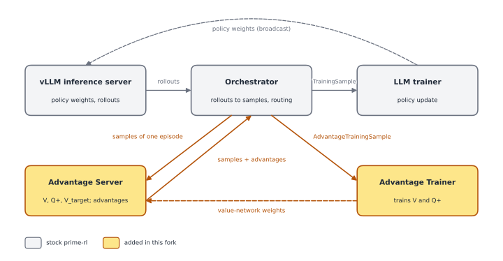
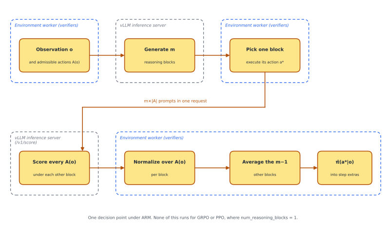
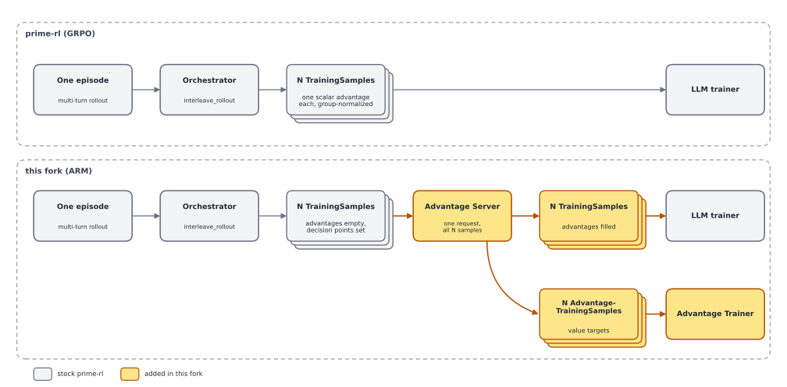

# ARM for LLM agents in prime-rl

## 0. Summary

Upstream prime-rl only implements GRPO, which assigns one advantage per rollout and broadcasts it to every token. This fork adds per-decision credit assignment, in two forms: PPO with a learned value function, and ARM, a method from counterfactual regret minimization that scores each decision against a learned regret network. It does this with two new processes alongside prime-rl's three. An **Advantage Server** owns the value networks and computes advantages. An **Advantage Trainer** trains them. The fork also adds a per-token and per-decision-point data contract, and the rollout-side machinery that scores every admissible action at every decision point. GRPO is unchanged and is still the default.

I built it for an MSc thesis on credit assignment under context truncation on ALFWorld. The results and the theory are in the writeup, [docs/arm-writeup.pdf](docs/arm-writeup.pdf). This README does not repeat them. The environment lives in the verifiers fork, [sbconlon/verifiers](https://github.com/sbconlon/verifiers). Everything described here is on the branch `feature/action-level-arm` in both repos.

**Figure 0.1.** The five processes. The two colored processes and the colored hops are the whole addition. Everything else is stock prime-rl.



## 1. Rollout generation

What changed: the rollout now carries, at every decision point, the admissible action set, which action was taken, and the policy's probability of that action.

The environment work is in the verifiers fork. ALFWorld runs as a multi-turn environment that exposes the admissible actions at each turn and truncates the message history to a fixed token budget, oldest turns first. The environment's own README covers it.

An LLM outputs probabilities over tokens, but ARM needs the probability of an action. Getting from one to the other is the part of rollout generation that is new. At each decision point the policy writes a reasoning block and then an action. The environment samples m reasoning blocks, executes the action from one, and asks how likely that action was under the others. The model's raw probability of an action string is spread over every string it could have written. To turn it into a choice among the admissible actions, the environment scores every admissible action as a continuation of each other block and renormalizes over the set. π̂ is the executed action's share, averaged over those blocks. Holding the executed block out keeps the estimate from being biased upward by the block that chose the action. The verifiers fork has the math, and the writeup explains why the estimate takes this form.

Scoring every admissible action under every reasoning block is m×|A| teacher-forced prompts per decision point, and the first version choked on it. Each prompt went through the standard completions endpoint and came back with a logprob for every position, so the payloads were large and vLLM sat with a few requests running and hundreds waiting while the GPU idled. The fix has three parts. First, the environment sends one request per decision point with every prompt in it. Second, it warms vLLM's KV cache with the shared observation-and-reasoning prefix first, so the prompts hit the cache instead of recomputing it. Third, the inference server got a custom scoring route that sums the logprobs over the action span on the server and returns one number per prompt.

Two knobs are config. `num_reasoning_blocks` sets how many reasoning blocks the environment samples. `use_token_client = true` on the orchestrator builds the client the scoring calls go through. GRPO and PPO runs leave `num_reasoning_blocks` at 1, and with one block the environment skips the scoring path entirely.

**Figure 1.1.** What the rollout carries.

| prime-rl (GRPO), per rollout | this fork (ARM), per rollout |
|---|---|
| `prompt_ids`, `prompt_mask` | same |
| `completion_ids`, `completion_mask`, `completion_logprobs` | same |
| `advantage: float` | `advantages: list[float]`, see Section 2 |
| `reward` | same |
| | plus one `DecisionPoint` per decision point, with |
| | `admissible_actions: list[str]` |
| | `executed_action_idx: int` |
| | `pi_hat: float \| None` |
| | `response_start: int`, `response_end: int` |

The environment writes three keys into each step's extras, `admissible_actions`, `executed_action` and `pi_hat`. The orchestrator turns them into the `DecisionPoint` in the right column.

**Figure 1.2.** The scoring path for one decision point. None of it exists upstream.



## 2. Rollout packaging

What changed: a training sample carries a list of advantages, one per completion token, and a list of decision points, and all of an episode's samples travel to the Advantage Server together.

Upstream, the orchestrator turns a multi-turn rollout into one or more `TrainingSample`s with a scalar `advantage`, and the trainer broadcasts that scalar into a per-token list at packing time. In the fork the broadcast moved into the orchestrator. `TrainingSample.advantage` became `advantages: list[float]`. The packer checks that the list is as long as the completion and does not know which algorithm produced it.

The executed action is not always in the admissible set. The model can emit an action the environment would reject. The orchestrator adds it to the set when it is missing and records its index, so π_RM, Q+ and π̂ are all defined for the executed action with no special case. This lives on the prime-rl side because verifiers does not depend on prime_rl.

The orchestrator can split one episode into several samples. The value recursion has to span the splits, so every sample from an episode goes to the Advantage Server in one request and is split back apart on return. GRPO samples flow through the same types. For them the orchestrator fills `advantages` with the group-normalized value, repeated across the completion.

**Figure 2.1.** `TrainingSample` before and after, from `src/prime_rl/transport/types.py`.

prime-rl (GRPO):

```python
class TrainingSample(msgspec.Struct):
    prompt_ids: list[int]
    prompt_mask: list[bool]
    completion_ids: list[int]
    completion_mask: list[bool]
    completion_logprobs: list[float]
    completion_temperatures: list[float]
    teacher_logprobs: list[float] | None = None
    advantage: float | None = None
    reward: float | None = None
    # VLM and MoE fields unchanged
```

This fork (ARM):

```python
class DecisionPoint(msgspec.Struct):              # added
    response_start: int
    response_end: int
    admissible_actions: list[str]
    executed_action_idx: int
    pi_hat: float | None = None

class TrainingSample(msgspec.Struct):
    # ...same token fields...
    advantages: list[float] | None = None         # changed
    reward: float | None = None
    decision_points: list[DecisionPoint] | None = None   # added
```

`AdvantageTrainingSample` is the mirror type that carries the value-network targets. It repeats the prompt and completion ids and masks of its `TrainingSample` and adds `v_targets`, `q_plus_targets` and `decision_point_targets`. It mirrors the token fields so the same transport can carry it.

**Figure 2.2.** The episode split.



## 3. Credit assignment

Upstream computes advantages locally in the orchestrator in a few lines. The fork sends samples to a separate process.

### 3a. The Advantage Server

What changed: advantage computation moved out of the orchestrator into a new process that owns the value networks, mirroring how the inference server owns the policy.

The value networks and the policy never share a process. The Advantage Server owns the value networks. The vLLM server owns the policy. Neither has the other's weights. The Advantage Server is an HTTP process on the same pattern as the inference server, with one compute endpoint and one weight-update endpoint. It receives every sample of one episode, with its decision points and π̂ values, and returns each sample twice: the `TrainingSample` with `advantages` filled, and an `AdvantageTrainingSample` with the V and Q+ targets, in matching order. Every step it takes new value-network weights from the Advantage Trainer. It never trains.

Inside, one function dispatches on the algorithm. PPO runs GAE against V. ARM reads V(o) and Q+(o, a) for every admissible action and hands them to the advantage math in Section 3c. Scoring Q+ over the admissible set has three compute modes, a naive one and two that reuse the observation's KV cache, and each optimized mode is tested equal to the naive one. A decision point whose π̂ is missing, which happens when scoring failed on that turn, has its advantage zeroed and its value targets kept.

### 3b. The value networks

What changed: three value networks, V, Q+ and V_target, as LoRA adapters on one frozen copy of the policy's starting checkpoint, each with a scalar head.

The backbone loads the starting checkpoint without its LM head and freezes it. Every projection in the standard LoRA target list is wrapped in prime-rl's own multi-adapter LoRA with three adapter slots, one each for V, Q+ and V_target. Each slot gets a scalar head, `nn.Linear(hidden, 1)`, with its weight and bias zeroed at init. The runs use rank 16 and alpha 32.

V(o) is read at the last token of the observation. Q+(o, a) appends the action text to the observation, runs the Q+ adapter under normal causal attention, and reads the head at the action's last token. Any admissible action can be scored that way, not only the one taken. The observation is prefilled once and each action continues off the shared KV cache, which is what makes |A| actions per decision point affordable. V_target is a parallel adapter slot. A Polyak update moves it toward V by τ every step, `polyak_tau = 0.005` in the runs. Nothing is swapped.

Zero-initialized heads mean every read is 0 before training, which makes the cold start well defined. Every regret is 0, so π_RM is uniform over the admissible set, and the first advantage on each decision is log(1/|A|) − log π̂(a*|o).

### 3c. The math

What changed: the advantage at a decision is the log-ratio between the regret-matching policy given by the value networks and the policy's own probability of the action it took.

- **Regret-matching policy.** `π_RM(a|o) ∝ max(0, Q+(o,a) − V(o))` over the admissible set, uniform if every regret is ≤ 0.
- **Advantage.** `A(a*) = log π_RM(a*|o) − log π̂(a*|o)`, broadcast across every token of the reasoning block and action that produced a*. Both probabilities are floored at 1e-6, which caps the magnitude near 13.8.
- **Value target.** `v_target = g_k`, the n-step return at γ = 1. ALFWorld pays only at the end, so this is the episode reward.
- **Regret target.** `q_plus_target = φ · max(0, Q+_prev(o,a*) − V_prev(o)) + g_k`, the CFR+ accumulation with a DCFR-style discount φ on the carried-forward regret. The first run had no discount, the accumulated regret grew without bound, and the policy collapsed with it. The runs since use φ = 0.9.

PPO uses the same server with GAE against V and no Q+. The writeup covers why the log-ratio, what its fixed point is, and what happened when it ran.

**Figure 3c.1.** GRPO and ARM, side by side.

| | GRPO | ARM |
|---|---|---|
| Advantage | group-normalized reward | `A(a*) = log π_RM(a*\|o) − log π̂(a*\|o)` |
| Granularity | per rollout: every token in a rollout gets the same value | per decision: every token in a decision gets the same value, many decisions per rollout |
| Learned quantities | none | V and Q+, with targets `v_target = g_k` and `q_plus_target = φ · max(0, Q+_prev − V_prev) + g_k` |
| Extra processes | none | Advantage Server and Advantage Trainer |

## 4. Policy update

What changed: no change to the policy update. Only the advantages feeding it are different.

The trainer consumes the per-token advantages through the same loss for GRPO, PPO and ARM, so the advantage is the only variable in the comparison. The loss multiplies the advantage tensor into the clipped importance ratio elementwise and does not know which algorithm produced it. Neither does the packer. The LLM trainer to vLLM weight broadcast is stock. The regression harness in Section 7 is what guarantees GRPO's numbers did not move.

## 5. Value-network update

What changed: a second training process, the Advantage Trainer, regresses V and Q+ against the Advantage Server's targets and broadcasts the result back to it every step.

The Advantage Trainer is a small standalone loop. It reuses the value-network module, the transport layer, and the checkpoint layout, and has its own per-slot AdamW with separate learning rates for V and Q+. It has no LR scheduler and runs on one GPU.

It consumes `AdvantageTrainingSample`s. The loss is MSE on V at each observation boundary plus MSE on Q+ at `[o, a*]` for each decision point. The V leg is one batched forward and one backward. The Q+ leg runs one forward and backward per decision point so only one Q+ graph is in memory at a time. Gradients land in disjoint adapter slots either way. Each step it receives a batch, runs `n_epochs` of minibatch SGD, Polyak-updates V_target, then serializes the LoRA weights and heads and POSTs them to the Advantage Server. Checkpoints go to `value_state.pt` beside the LLM checkpoint, and resume restores all three networks from it.

### 5b. Warm-start

An offline step that pretrains V and Q+ before RL. It is off by default. Serve the base policy, run `warmstart-collect` to generate ALFWorld rollouts and write a dataset of samples with their Monte Carlo returns, then run `warmstart-train` to fit V and Q+ to those returns with the same regression code the online trainer uses. It sets V_target = V and saves `value_state.pt`.

Both value processes have to load it, through `warm_start_path` on the Advantage Server and on the Advantage Trainer. The Advantage Server only ever takes weights from the Advantage Trainer, so if the Trainer starts cold its first broadcast overwrites a warm Server back to zero.

On the runs the warm-start fixed the value level and did not fix training. The writeup has the numbers and the diagnosis.

## 6. How to run

The ALFWorld configs under `configs/alfworld/` are the thesis run configs as they ran, with the paths of the machines they ran on. Edit `model`, `data_path` and `output_dir` first.

**GRPO baseline on ALFWorld.**

```bash
uv run rl @ configs/alfworld/grpo_1.5b_ctx2048.toml
```

`algorithm` defaults to `"grpo"`. With no `[advantage_server]` and no `[advantage_trainer]` section the launcher starts the stock three processes. `configs/alfworld/grpo_1.5b_ctx16384.toml` is the full-window control from the writeup.

**ARM run.**

```bash
uv run rl @ configs/alfworld/arm_action_1.5b_ctx2048.toml
```

The settings that make it ARM:

- `algorithm = "arm"` under `[orchestrator]`, and `[orchestrator.advantage_server]` with the server's `base_url`.
- `[advantage_server]` and `[advantage_trainer]` sections. The launcher writes them out as their own configs, spawns `uv run advantage-server` and `uv run advantage-trainer`, and wires the transport between them.
- `use_token_client = true`.
- `online_difficulty_filtering = false` under `[orchestrator.buffer]`.
- `args.num_reasoning_blocks` and `args.max_context_tokens` on the training environment. The runs used 2 and 2048.

The config sets `num_train_gpus = 1` and `num_infer_gpus = 1`, and the launcher reserves one more GPU each for the Advantage Server and the Advantage Trainer, so a run takes four GPUs, one per process.

**Warm-start.**

```bash
uv run inference @ configs/value-warmstart/inference.toml
uv run warmstart-collect @ configs/value-warmstart/collect.toml
uv run warmstart-train @ configs/value-warmstart/warmstart-train.toml
```

`value_state.pt` lands at `<output_dir>/checkpoints/step_0/trainer/value_state.pt` under the `output_dir` in `warmstart-train.toml`. Set that path as `warm_start_path` under both `[advantage_server]` and `[advantage_trainer]` in the run config.

## 7. Testing

`uv run pytest tests/unit -m "not gpu"` runs 662 tests on CPU in about three minutes, and `uv run pytest tests/integration` runs 35 subprocess tests against the configs under `configs/ci/integration/`. One CPU test fails on this branch, `test_load_configs` on the token-level ARM canary config inherited from the previous branch.

GRPO is guarded three ways: a golden-master test that runs committed fixtures through the stock advantage function and compares to a pickled reference at `atol=1e-7`, property tests on GRPO's invariants, and the reward-goes-up integration canary. Every optimized forward path in the value networks and the Advantage Server is tested equal to a naive oracle.

## 8. Status

`feature/action-level-arm` is the live branch in both repos. It has GRPO as the default, PPO through the same server, action-level ARM, the warm-start, and the regression harness. Token-level ARM, top-K action-set extraction and the single-token Q+ kernel from the earlier design are kept on this branch as dead code and run on `feature/arm-ppo`.

ARM did not train stably on ALFWorld. The regret network never learned to rank the admissible actions and the policy drifted into rare-token gibberish. The writeup has the diagnosis and the next experiments.

This is the code for the MSc thesis "Beyond Trajectory-Level Credit Assignment: Counterfactual Regret Minimization for LLMs", Bocconi University, advised by Martino Banchio, defended July 2026. The license is Apache 2.0, inherited from Prime Intellect's prime-rl.

## 9. Where things live

| Component | Path |
|---|---|
| Data contract, `TrainingSample`, `DecisionPoint`, `AdvantageTrainingSample` | `src/prime_rl/transport/types.py` |
| Episode to samples, decision points | `src/prime_rl/orchestrator/trajectories.py`, `src/prime_rl/orchestrator/admissible.py` |
| Advantage Server, `POST /compute_advantages_and_targets`, `POST /update_weights` | `src/prime_rl/advantage_server/server.py`, `compute.py` |
| ARM math, `pi_rm`, `action_advantage`, `n_step_return_action_level`, `q_plus_target` | `src/prime_rl/advantage_server/action_advantage.py` |
| Value networks, `ValueNetworkBackbone`, `MultiLoRALinear` slots, Polyak update | `src/prime_rl/orchestrator/value_networks.py` |
| Q+ compute mode, `naive`, `shared_o`, `kernel`, `auto` | env var `PRIME_RL_ADV_Q_PLUS_MODE` |
| Advantage Trainer, loss, optimizer, checkpoints | `src/prime_rl/advantage_trainer/train.py`, `shared.py`, `ckpt.py` |
| Warm-start collect and train | `src/prime_rl/value_warmstart/` |
| Policy loss, unchanged | `src/prime_rl/trainer/rl/loss.py` |
| Scoring route, `POST /v1/score` | `src/prime_rl/inference/vllm/server.py` |
| ALFWorld environment, π̂ estimate, truncation | verifiers fork, `environments/alfworld/` |
| Run configs | `configs/alfworld/`, `configs/value-warmstart/` |
| Regression harness | `tests/unit/orchestrator/test_advantage.py`, `tests/unit/advantage_server/` |
